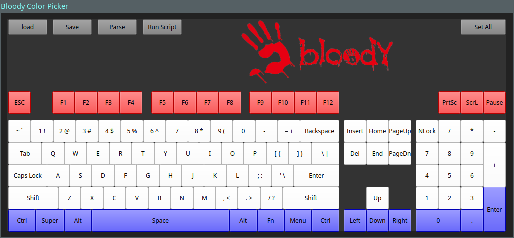

# RGB control GUI using PyQT6 for A4Tech Bloody keyboard for Linux

> This script allows you to set the RGB backlight color on A4Tech Bloody keyboards using a GUI interface.


### Configuration

- The file 'bloody_keycolor.conf' contains two directorys the top most is the profile directory and the bottom is the 'Set_Bloody_Key_Color.py' script location
- In order to run the script from the gui you must set the bottom directory
``` bloody_keycolor.conf
#KeyColor GUI Configuration File line 2 is profile directory line 3 is active_profile directory (e.g where the color change script is)
/path/to/script/profiles
/path/to/script
```

### How to use:

- On the keyboard press `Fn` + `1`.
- Make sure you are a sudo user.
- Run the script:
```console
$ Bloody_KeyColor_GUI.py
```
- This will launch the GUI you can set colors per key by clicking them or set all by using the setall button


- Profiles can be saved and loaded with the 'save' and 'load' buttons



- When you are ready to apply the profile use the parse button to save 'active_profile' to the same location as the helper script
- Finally use 'run script' to apply the 'active_profile'

- The 'active_profile' can also be applied directly by running
```console
$ Set_Bloody_Key_Color.py
```

### Automatically setting RGB at Boot time

- Create a helper script that your systemd service can run
```setbloodyrgb.sh
#/bin/bash
cd /path/to/script
python /path/to/script/Set_Bloody_Key_Color.py
```
- This will run the 'Set_Bloody_KeyColor.py' which will applt whatever is contained in the 'active_profile' produced by the GUI
-Make it executible 
```console
$ sudo chmod +x setbloodyrgb.sh
```

- Create a service for systemd to launch at boot time in /etc/systemd/system/
```bloody-rgb.service
[Unit]
Description=Set Bloody RGB on Boot

[Service]
Type=oneshot
ExecStart=/path/to/setbloodyrgb.sh
StandardOutput=journal

[Install]
WantedBy=multi-user.target
```

- Activate the service 
```console
$ sudo systemctl enable bloody-rgb.service
$ sudo systemctl start bloody-rgb.service
```

- At Boot time the helper script will launch and set the RGB based on 'active_profile'

### Credits

Credit for the core functionality of this script goes to apo5tol for the parent bloody_keyboard_rgb_control I have striped most of the code from that and am using the USBDevice class directly to send data to the Keyboard. In addition I did my own digging into the USB data to determine what to send to the keyboard however i used apo5tol's init section and final section in the final version of my script.

Credit also goes to the openrazer project for information on how to look at the USB data initially.

### Disclaimer 

I am not responsible for any damage to your device. I have only tested on my own model of keyboard and can only confirm that this works on my system with my specific hardware.
